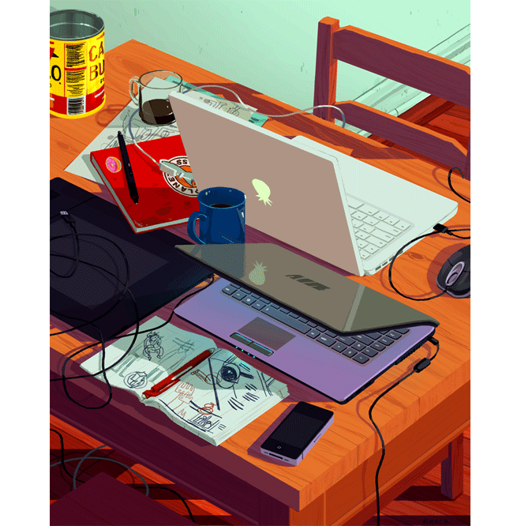

<h1 align="center">Hi there, I'm Prathamesh Sahebrav Jadhav! 👋</h1>
<h3 align="center">A passionate technocrat who’s always seeking opportunities to apply learning in the real world. If you're here, take a look at my repositories on GitHub!</h3>

<picture>
  
</picture>

- 🌱 I’m currently learning more about **Full Stack Development, Open Source, and Data Structures and Algorithms.**
- 👯 I’m looking to collaborate on **Projects based on React and Java.**
- 🏆 Goal: **Contribute more to open-source projects.**
- 💬 Ask me about **Frontend Development, DSA, Java Full Stack Development, Spring Framework, Spring Boot**
- 📫 How to reach me: **prathamesh.jadhav-0198@gmail.com**
- ⚡ **Would love to connect with like-minded people.**

 

<h3 align="left">Connect with me:</h3>

  
  
  
  
  

 

## 🏆 Competitive Programming

  
  

 

## 🚀 Tech Stack & Tools

  

 

## 📊 GitHub Stats

  

  

 

## 🌐 Connect with Me

  
  
  
  

 

## 🐍 GitHub Contribution 

<picture>
  <source media="(prefers-color-scheme: dark)" srcset="https://raw.githubusercontent.com/Prathamesh-2005/Prathamesh-2005/output/github-snake-dark.svg" />
  
</picture>
